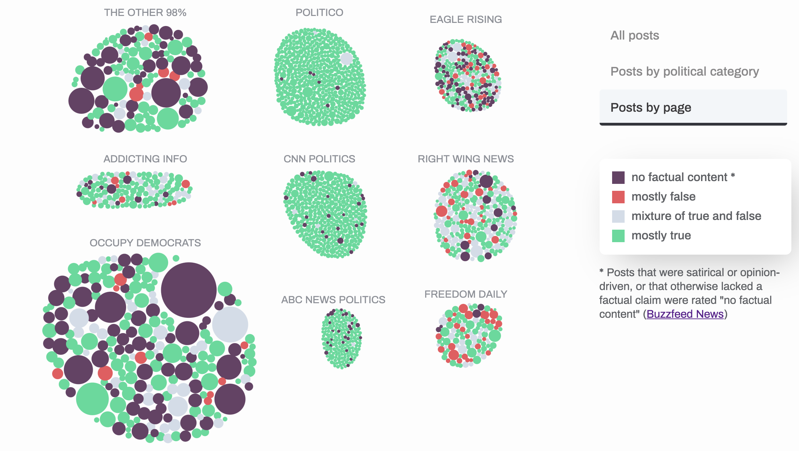
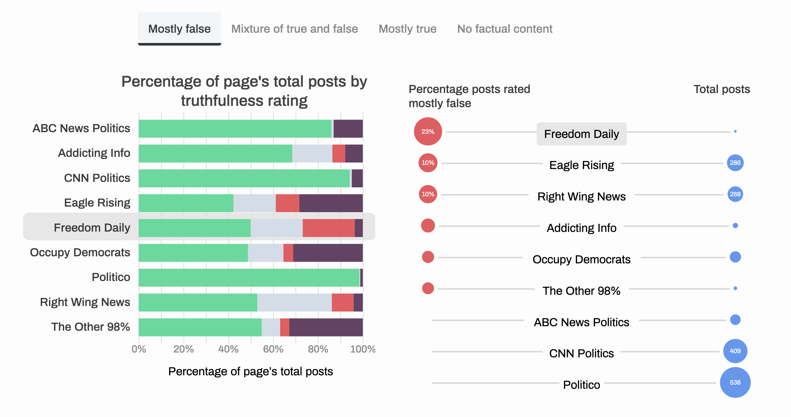
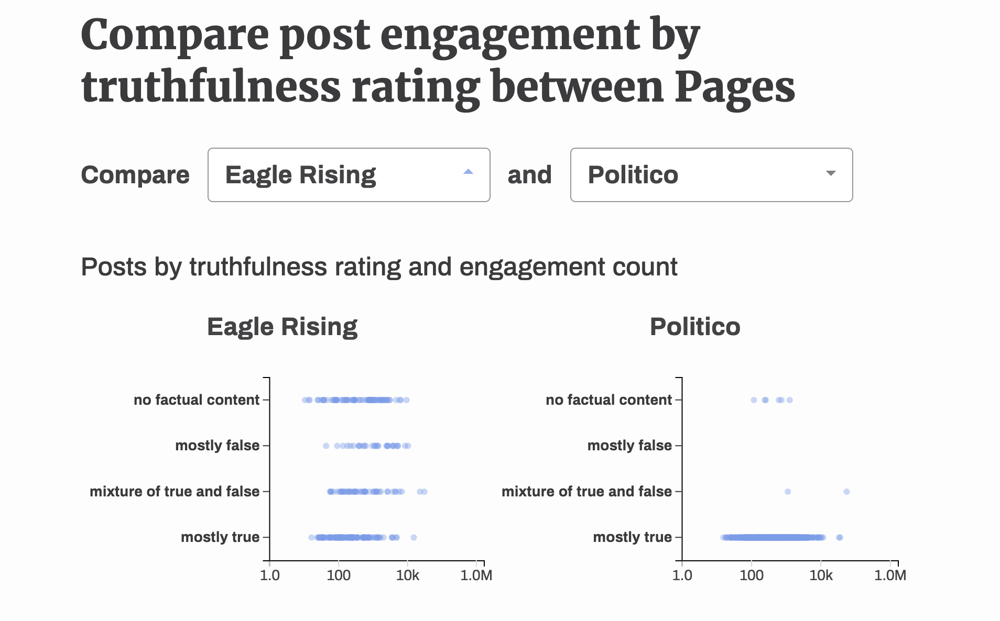

# CPSC 436V: Milestone 2

# Design rationale

## Exploring post engagement

The bubble visualization allows the user to explore the distribution of posts, post engagement, and truthfulness across all posts from our dataset. The task at hand is not to understand the exact proportions of accurate versus inaccurate posts, since that's what the purpose of the stacked bar is for. Rather, this visualization allows the user to explore individual posts and identify outliers. The default view for this visualization shows all bubbles grouped together, so the viewer has a sense of the overall composition of the truthfulness of posts across all Pages. The selection interaction allows the user to group bubbles by political category and Page, which gives them a snapshot of which political categories or Pages have the most engagement, and what type of posts get the most engagement within those categories. 

The area of each circle encodes the total engagement count for that post. Total engagement count was a derived variable calculated by summing up counts of shares, comments and reactions for each post. The domain of engagement count ranged from under a hundred to over a million. Although it's difficult to discern small differences in area between circles, the visualization allows the user to easily spot outliers, such as posts that have gotten a lot more engagement relative to others. 

Hue encodes the truthfulness rating for that post, indicating whether it was rated mostly false, true, a mixture of both, or an opinion/satirical post. We chose hue to encode the rating using hue because the cardinality of the attribute was low, and because certain hues already semantically denote the categories we working with (green for true, red for false, grey for neutral). 

Upon hovering on a tooltip, the user sees the Page, the truthfulness rating, the engagement count, and the format of the post. On click, a link to the original Facebook post is opened in a new tab so the user can understand the contents of the post for themselves.

## Page accuracy visualizations

We decided to pivot away from our novel square glyph chart, as its narrative seemed too similar to the bubble chart's. The old goals of comparing truthfulness across different political leanings, and across different post types, remain.

We also want to explicitly explore the interplay between post quantity and truthfulness at an overview scale, and we've chosen a new visualization, which lists each page with two point marks size-coded to represent the percentage of posts of a certain Rating made by a Page against all posts for that Page (and colour-coded to represent Rating as above). The total posts vary from about the tens to the hundreds (maxing out around 500), while percentages run the full scale from 0 to 98% or so. Both of these are quantitative, just like the raw data — evidenced by the fact that we just computed some new attributes from them. These pages are then ranked by the Rating count descending. We feel that this more saliently conveys the relationship between how much each page posts and how much of those are truthful.

For the purpose of comparing across all four Rating types, we added tabs to switch between toggle between displaying different Ratings. This also automatically reorders the elements such that the descending ranking is preserved. Therefore, which Pages have the greatest accuracy/inaccuracy/etc is always perceptually easy to understand.

This visualization is juxtaposed against the stacked bars as a multiform detail-overview relationship. The page rankings show the percentage of Pages with a certain Rating contrasted against total posts, which suggests how many posts a Page made as well as how truthful they are. The 100% stacked bars drills down into a granular distribution, but does not reveal anything about totals (it simply compares percent distributions). These integrate to more meaningfully reveal how truthful a Page's posts are.

To better relate this novel visualization with our stacked barchart, we've added bidirectional highlighting at the page level, so that the audience can quickly view at which ranking a page's breakdown stands, or so that they can easily explore the truthfulness breakdown of a given page. Then, we added unidirectional highlighting (at the percentage of posts with that Rating level) from the ranking to the stacked barchart. This unidirectional highlighting emphasizes the percentage of posts with the current Rating within a more granular breakdown of the truthfulness distribution.

Lastly, because circle area and radius are somewhat difficult to compare perceptually, we've used a square root scale for the size, and included numbers where it would be aesthetically pleasing, so that readers can ground themselves with a concrete sense of magnitude.

## Comparing engagement and truthfulness between Pages

The small multiples visualization lets a user compare the truthfulness rating and engagement count of posts made by any two pages, side by side. Each point on a scatter plot is a point mark that represents a single post. This visualization enables the task we set out to facilitate: at a quick glance, the user can see how much engagement a page's posts receive based on how truthful each post is, and use the dropdown menu to choose any other page to compare those trends with. Since the points are rendered at 50% opacity, it is easy to see concentrations of many points, as well as outliers. 

The data used in this visualization is derived from the raw data with the function `processGroupedData` in `index.js`, which groups posts by their page.

Position on horizontal scale (i.e. x-axis) encodes the total engagement for each post—how many reactions, comments and shares it received. We used a log scale for this to account for the previously mentioned wide domain of this quantitative data (less than one hundred to over one million), allowing us to fit all of our points on the same axis, but also allowing for the user to quickly spot outliers. The scale is static, i.e. we took the global maximum engagement count across all posts made by all pages, so that comparisons between pages are consistent.

Position on vertical scale (i.e. y-axis) encodes truthfulness rating. As this is an ordinal characteristic with a cardinality of four, the two extremes—"no factual content" and "mostly true"—are positioned at the top and bottom of the axis, respectively. 

## **Data processing**

In addition to the data taken directly from [our dataset](https://www.kaggle.com/mrisdal/fact-checking-facebook-politics-pages/data), we dynamically compute the total count of posts per Rating for each Page. We also compute the total number of posts per Page overall. For the scatterplot, we calculate other similar summaries, such as the total engagement count per Rating per Page, and the total engagement count overall. These are necessary to create the small multiples scatterplots.

# **Project Management**

## **Status update**

[Project Tasks](https://www.notion.so/46c593b7d6464617a303a112f2952fdd)

## **Contributions breakdown**

Yes, everyone contributed equally. 

**Sherry**

- Visual design for visualizations & website
- Implemented bubble visualization
- Helped teammates with stacked bar
- Implement shared tooltip component

**Luce**

- Implemented stacked bar
- Implemented small multiples scatterplots with interaction

**Amy**

- Implemented ranking visualization
- Created linked highlighting with stacked bar charts
    - Unidirectionally and bidirectionally

## **Team Process**

| | Weak | Satisfactory | Good | Excellent | Actionable items if any |
|------------------------|------|--------------|------|-----------|-------------------------|
| Clear vision | | | |✔| |
| Organized, cooperative | | | |✔ | |
| Time management | | |✔ | | Begin working on components, especially writeup, earlier (or as we go) |
| Knowledge base | | | |✔ | |
| Efforts communicated | | | |✔ | |